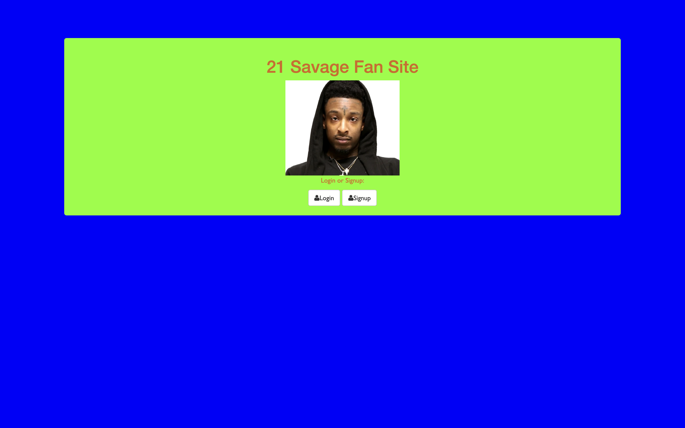
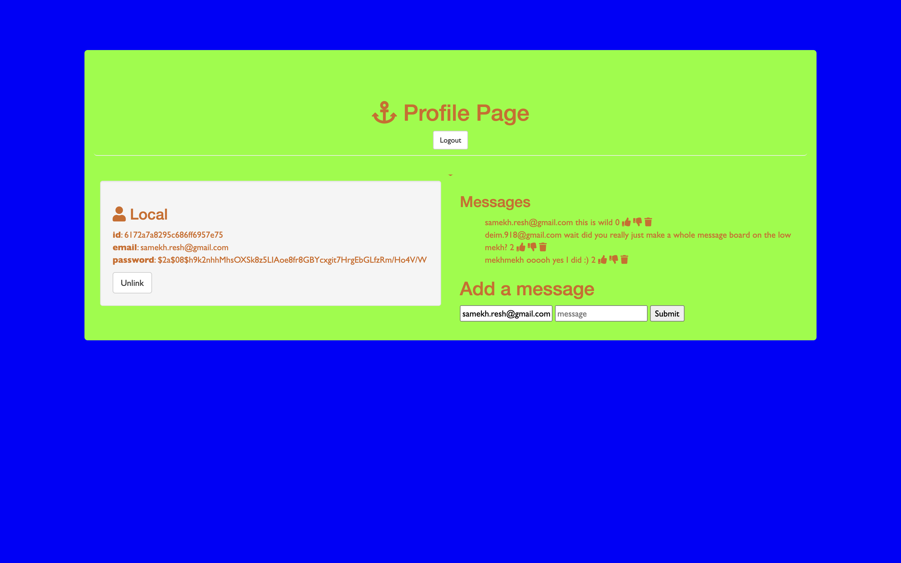
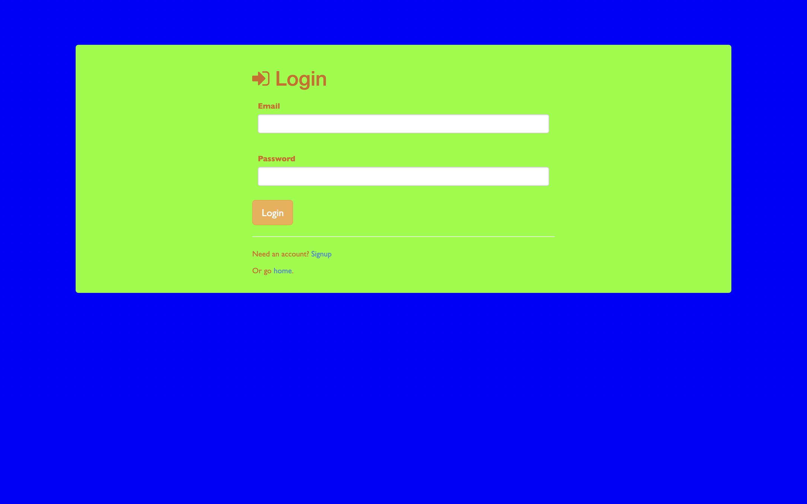

# sav auth

**link to project**

### How It’s Made
express framework, nodemon, vs code, passport, mongoose , and faith that I can do anything. 

<b>Langs used</b>
Javascript, HTML5, CSS3, express.js and node.js

### optimizations

I think the main optimization that I can come up with is separating the message board page along

### Lessons Learned
Trying to understand every how every little gear in the project spins may stop you from fixing the actual clock
——
This project was a lesson in telling myself when to focus on understanding the functionality and when to focus on the bigger picture. I was too caught up with trying to focus on how every little piece of the function works instead of focusing on how the larger parts work together to give you a desired result. 
~~~~also simpler, how to create a like and dislike and delete feature and how to do create logins and sign ups while using Passport.